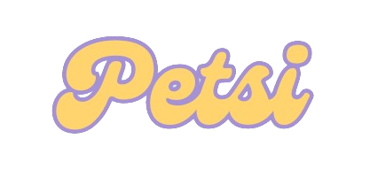
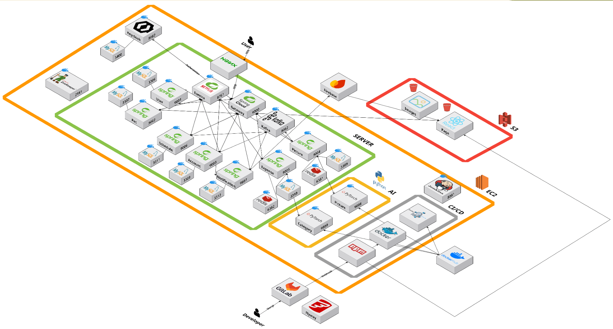
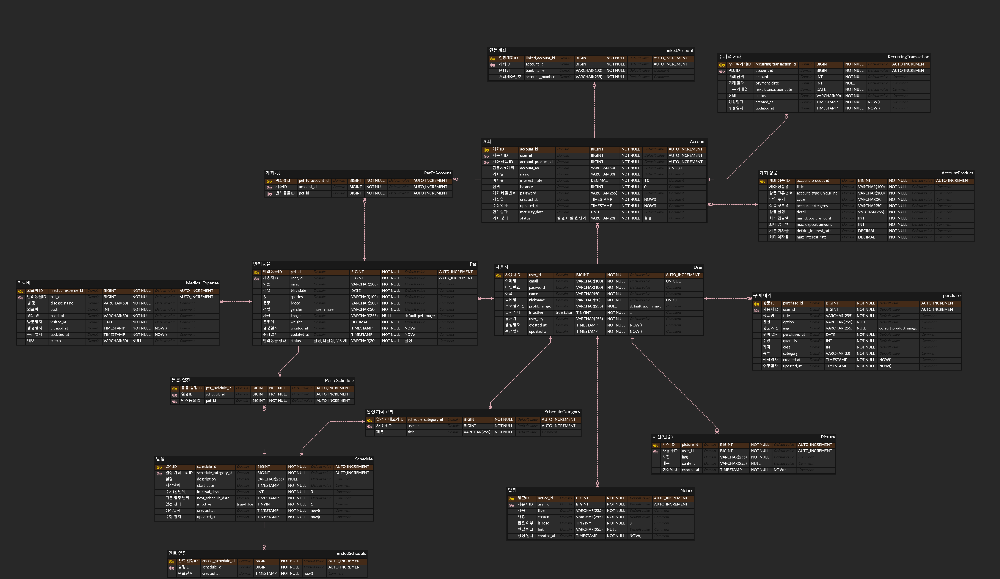

# 📌 Petsi

  

## ✨ 주제
- 반려동물 적금 및 소비/일정 관리 서비스

## 📅 기간
- 2024.08.19 ~ 2024.10.11

## 📜 프로젝트 컨셉 및 주요 기능
### 1️⃣ 목적
- 반려동물 양육 운용비를 모으고, 반려동물 관련 소비 및 일정을 관리

### 2️⃣ 페르소나
- 반려동물 소비 관리를 통해 양육비 관리가 필요한 사람
- 반려동물 일정을 계획하고 확인하고 싶은 사람
- 반려동물 양육 비상금 혹은 운용비를 모으고 싶은 사람

### 3️⃣ 주요 기능
- 계좌 등록, 조회, 이체 등 기본 금융 기능
- 반려동물 적금 상품을 통한 저금
- 반려동물과의 사진을 통한 추가 금리 및 갤러리 기능
- 크롤링 및 직접 등록을 통한 반려동물 관련 소비 관리

### 4️⃣ 기대 효과
**서비스 이용자**
- 반려동물 관련 적금, 소비, 일정을 한 서비스에서 해결할 수 있다.
- 사진 인증을 통해 추가 금리와 반려동물과의 추억을 기록하는 갤러리를 얻을 수 있다.
- 메인 서비스 이외 기본 금융 서비스를 이용할 수 있다.

**서비스 판매자**
- 반려동물 관련 데이터를 확보할 수 있다.
- 트래픽을 통한 추가 서비스를 제공할 수 있다.

## 💻 개발 환경 및 문서
### 1️⃣ 활용 기술

  
  
  
  
  
  
  

  
  
  

  
  
  
  
  

  
  
  
  

  
  
  
  
  

  
  

### 2️⃣ Architecture

  

### 3️⃣ ERD

  

## 🎨 화면 구성

### 로그인

  

### 펫 등록

  

  

### 계좌 개설

  

  

### 계좌 조회

  

  

### 사진 인증

  

  

### 사진 인증 상세 조회

  

  

### 소비 내역 등록

  

  

### 소비 내역 조회

  

  

### 일정 생성

  

  

### 일정 완료

  

  

## 👥 참여 인원 및 역할
### 💗TEAM SSAMBA💗
|정상영|최이서|양지웅|조수연|최다환|
|:---:|:---:|:---:|:---:|:---:|
||||||
|**FE, Leader**|**FE**|**Infra**|**BE**|**BE**|
